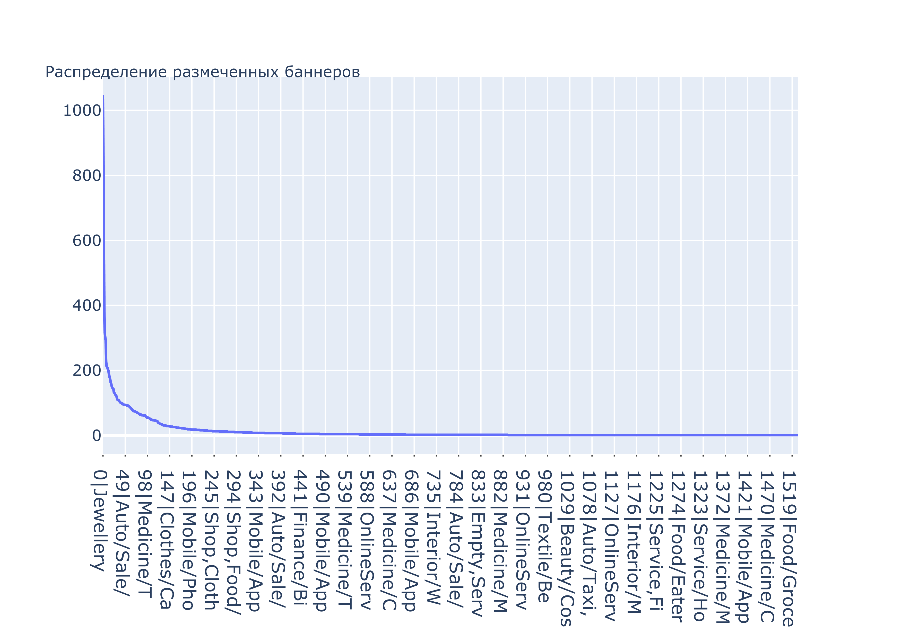
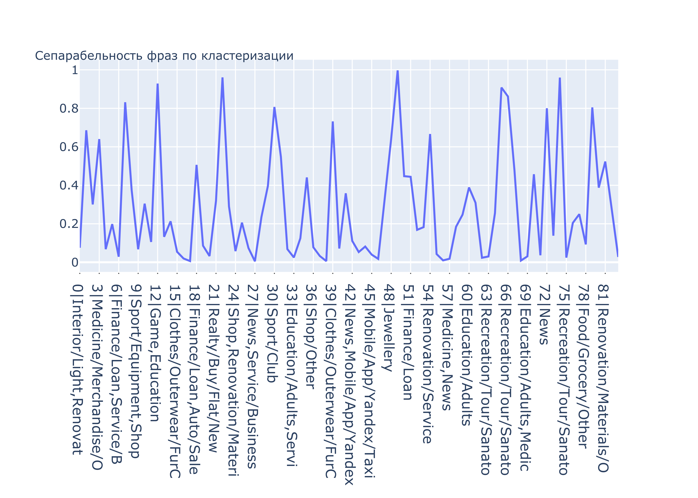

## `VK` doroga pipeline

### Что исследовали

Исследовали эффективность предобученной внутренней нейронной модели для ранжирования на разделимость (сепарабельность) фраз рекламных баннеров в контексте категории.

### Цель исследования

Получить понимание того, насколько эту модель можно применять в дальнейшем, насколько она чувствительна к доменному сдвигу (на рекламных баннерах).

### Исследование

На входе у нас есть $N=20625$ примеров (фраз) баннеров, которые представляют из себя короткий текст. Каждый баннер $x_i$ относится к одному из $K=1533$ классов $c_j$. Разметка представляет из себя дерево с под-категориями (e.g. `/Auto/Sale` vs `/Auto/Sale/BMW`). К сожалению, она не супер точная, и местами, сложно понять, даже методом пристального взгляда что из себя представляет фраза (продажа авто или сервис по ремонту). Оригинальная разметка выглядит следующим образом

К сожалению, количество классов, на которые приходится $\leq 100$ примеров - $11741$, что больше половины всего датасеты. Поэтому просто их выкинуть будет слишком сильно урезать данные. В качестве предобработки было выбрано - оставить только те примеры, в названии которых (префикс) содержатся самые популярные классы. В таком случае, останется $\tilde N= 11925$ примеров с репрезентативным количеством на каждый класс.

Файл с результирующей кластеризацией прикреплен отдельно с возможностью посмотреть самые популярные кластера и, параллельно, справа увидеть сколько примеров относится к каждому из них. 

Для оценки качества кластеризации используется сепарабельность и делается следующим образом. Для каждого кластера $t_l$ выбирается $top_3$ частых класса, которые попали в этот кластер. Далее, собираются и объединяются все классы по всем кластерам и считается их “сепарабельность”, как покрытие по всем топикам, в который данный класс попал. 
$$
\varphi(c_j)=\sum_{c_j \in t_k} \frac{|\{x_i \in t_k | y_i == c_j \}|}{|\{x_i \in t_k\}|}
$$
Ниже график $\varphi$, по всем классам:

Видно, что $\varphi \leq 1$ по всем классам. Видно, что вспышки “близки к единице” происходят на общих классах `Game,Education`; `Jewellery`, что ожидаемо, тк это общие классы (верхняя классификация)

### Вывод

В целом, на предоставленном датасете с учетом его предобработки и низкоуровней классификации, модель модель почти идеально разделяет “общие” или верхнеуровневые теги (`Game` vs `News`), но плохо справляется с низкоуровевым разделением, например с разделением объявлений про тематику еды (`Food/Eatery/Pizza` vs `Food/Eatery/Cooked`) или же с разделением новостей о покупке недвижимости в стране или зарубежом - это $№ 5$  кластер (`Realty/buy/Country` vs `Realty/Buy/Flat/New`).

Сам файл кластеризации прикреплен, как `report.html` c возможностью интерактивного изучения топиков.