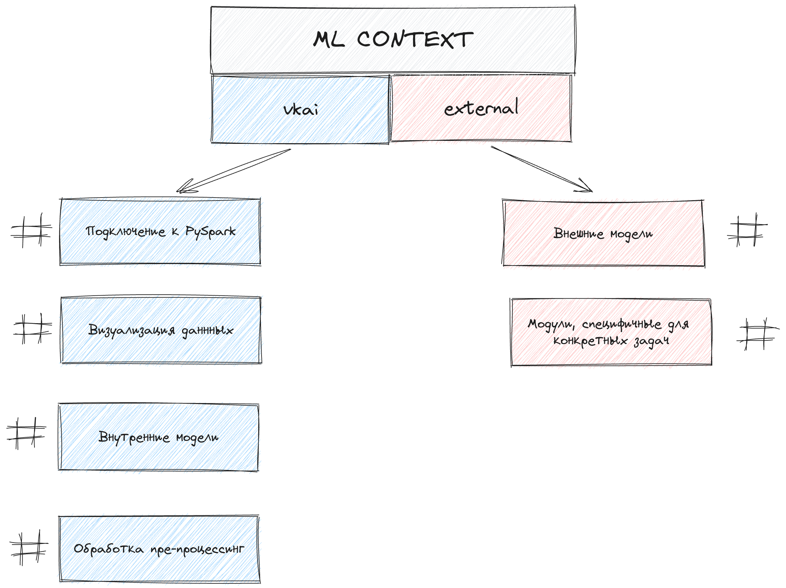

### Обзор

Весь код репозитория разделен на два отдельных модуля: внутренняя разработка - `vkai` и внешние решения (модели), которые мы используем в процессе - `external`.

### Начало работы
При запуске

```
pip install -r requirements.txt
make init
```


## Контент
- [Введение](#getting-started)
  - [Обзор](#contribution-guide)
  - [Начало работы](#installation)
- [vkai](#overview)
  - [Подключение к таблицам](#connecting)
  - [Кластеризация](#clustering)
  - [Документация](#documentation)
  - [Примеры](#minimal-examples)
- [external](#external)
  - [Обзор](#contribution-guide)


### Подключение к таблицам

Все модули для подключения находятся в `vkai/connecting`.

```
from vkai.connecting import SparkIgnitor
client = SparkIgnitor().connect()
```


### Примеры

Все примеры, реализованные на текущий момент, находятся в папке `notebook`.

### Кластеризация

Пайп-лайн, позволяющий получить кластеризацию по выгрузке любых текстовых данных (как размеченных, так и неразмеченных).
